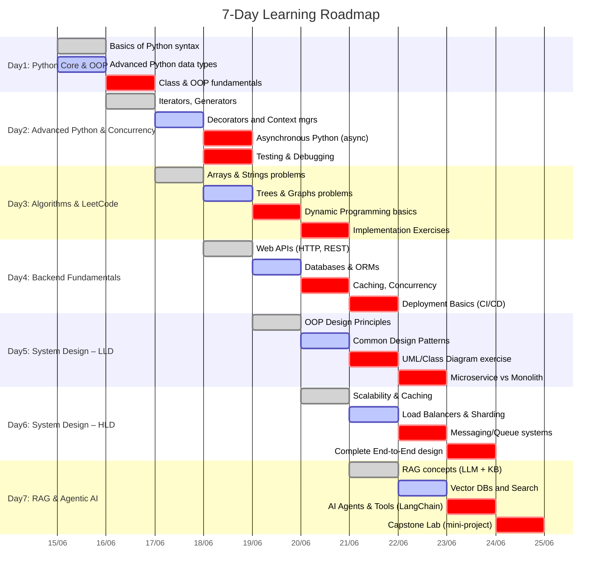

# Executive Summary

We outline a **7-day intensive roadmap** to take a senior backend engineer through Python/OOP refresher, prioritized coding practice (via LeetCode-style challenges), backend fundamentals, system design (low-level to high-level), and an introduction to modern AI (RAG and agentic AI). Each day has clear learning objectives, implementation-forcing tasks, time estimates, and checkpoint exercises. We also detail a complementary **10-day interview-preparation plan** as a separate Markdown file. The roadmap includes curated LeetCode problem lists by topic (with links and prompts), LLD/HLD design topics with sample exercises and diagrams, and a primer on RAG/AI agents with practical labs. A GitHub push plan (repo structure, commit strategy, CI/tests) is provided. Throughout, we use tables, Mermaid diagrams (timelines, flows), and Python code snippets to clarify concepts and steps. 

## Roadmap (7-Day Intensive Study)



### Day 1: Python Core & OOP (≈8 hours)

- **Topics**: Core Python syntax; built-in types (lists, dicts, sets, tuples); control flow (loops, comprehensions); functions (args/kwargs, lambdas).  
- **OOP Refresher**: Classes/instances; constructors (`__init__`); instance vs class variables; encapsulation; inheritance; polymorphism (method overriding); magic methods (e.g. `__str__`, `__eq__`); composition vs aggregation.  
- **Implementation Task**: Write a Python class hierarchy (e.g. `Animal` base class with `Dog`, `Cat` subclasses implementing a common interface). Example snippet:

    ```python
    class Animal:
        def speak(self):
            raise NotImplementedError("Subclasses must implement speak()")

    class Dog(Animal):
        def speak(self):
            return "Woof!"

    class Cat(Animal):
        def speak(self):
            return "Meow!"

    # Usage
    for a in [Dog(), Cat()]:
        print(a.speak())
    ```

- **Checkpoint**: Build a small module (`shapes.py`) defining shapes (circle, rectangle) with methods for area/perimeter. Write simple tests or prints to verify behavior.  

### Day 2: Advanced Python & Concurrency (≈8 hours)

- **Topics**: Iterators and Generators (custom `__iter__`, `yield`); `enumerate()`, `zip()`, `itertools` usage. Decorators (function decorators for logging or timing). Context managers (`with` statement, `__enter__/__exit__`).  
- **Concurrency**: Introduction to threading vs multiprocessing vs asyncio. Use `asyncio` for simple I/O-bound task (e.g. parallel HTTP requests simulation).  
- **Implementation Task**: Create a decorator that logs function arguments and return values. Write a small async function with `asyncio` (e.g. simulate fetching data from URLs concurrently).  
- **Testing/Debugging**: Practice using `pdb`, logging, and writing unit tests with `pytest`. Set up a simple test for one of Day1 classes.  
- **Checkpoint**: Code review of Day1 exercise; ensure PEP8 compliance, use `flake8` or similar.

### Day 3: Algorithm Practice & LeetCode (≈8 hours)

- **Focus**: Core DSA categories from [Interactive Coding Challenges (donnemartin)](https://github.com/donnemartin/interactive-coding-challenges) and LeetCode. Prioritize high-yield topics:
  - **Arrays & Strings**: e.g. *Two Sum* (LeetCode 1), *Container With Most Water*, *Valid Palindrome*.  
  - **Linked Lists & Trees**: e.g. *Reverse Linked List*, *Lowest Common Ancestor*, *Binary Tree Traversal*.  
  - **Dynamic Programming (DP)**: *Climbing Stairs*, *Longest Increasing Subsequence*.  
  - **Graphs/Backtracking**: *Word Ladder*, *Sudoku Solver*.  
  - **Hashing & Sorting**: *Group Anagrams*, *Top K Frequent Elements*.  
- **LeetCode List**:

    | Topic          | Example Problems (with links)                                                    | Implementation Prompt                          |
    | -------------- | ------------------------------------------------------------------------------- | ---------------------------------------------- |
    | Arrays         | [Two Sum](https://leetcode.com/problems/two-sum/), [3Sum](https://leetcode.com/problems/3sum/) | Implement using hashes/two-pointer. |
    | Strings        | [Valid Palindrome](https://leetcode.com/problems/valid-palindrome/), [StrStr()](https://leetcode.com/problems/implement-strstr/) | Use two-pointer or substring search. |
    | Linked List    | [Reverse List](https://leetcode.com/problems/reverse-linked-list/), [Cycle Detect](https://leetcode.com/problems/linked-list-cycle/) | Write node class and algorithms. |
    | Trees & Graphs | [Binary Tree Inorder](https://leetcode.com/problems/binary-tree-inorder-traversal/), [Lowest Common Ancestor](https://leetcode.com/problems/lowest-common-ancestor-of-a-binary-tree/) | Use recursion/stack for traversal. |
    | DP             | [Climbing Stairs](https://leetcode.com/problems/climbing-stairs/), [Coin Change](https://leetcode.com/problems/coin-change/) | Formulate recurrence and implement memo. |
    | Others         | [LRU Cache](https://leetcode.com/problems/lru-cache/) (Design), [Min Stack](https://leetcode.com/problems/min-stack/) | Use data structures (stack, dict). |

- **Implementation Tasks**: Solve 2–3 representative problems for each category. Focus on writing clean, testable code in Python. Use the test-driven style from Donne Martin’s repo (i.e., write assert-based tests for each solution).  
- **Checkpoint**: End-of-day mini-contest – pick one medium-level LeetCode, implement, and test in ~1 hour.

### Day 4: Backend Fundamentals (≈8 hours)

- **Web Architecture**: Review HTTP methods, status codes, REST principles. Quick exercise: Build a simple REST API with Flask or FastAPI to manage a resource (e.g. a “Todo” item).  
- **Databases**: Compare SQL vs NoSQL; ORMs (SQLAlchemy or Django ORM usage). Task: design a basic database schema (e.g., user/orders) and implement model classes.  
- **Caching & Concurrency**: Concepts of caching (in-memory, Redis), database indexing, and query optimization. Briefly cover threads vs async in backend.  
- **Deployment & DevOps**: Overview of containers (Docker), CI/CD pipelines. Setup a GitHub Action to run tests on push (if time).  
- **Implementation Task**: Extend the REST API: add database persistence and caching for a GET endpoint. Write integration test(s).  
- **Checkpoint**: Ensure API is reachable (e.g., via `curl`) and passes all tests. Document routes.

### Day 5: System Design – Low-Level Design (LLD) (≈8 hours)

- **OOP Design Principles**: SOLID principles, separation of concerns.  
- **Design Patterns** (Refactoring.Guru): Cover a few common patterns in Python context:
  - **Factory** (dynamic object creation),
  - **Singleton** (only one instance),
  - **Observer** (publisher-subscriber),
  - **Strategy** (algorithm interchange),
  - **Decorator** (extend functionality).
  
  Example (Singleton pattern in Python):  
  ```python
  class SingletonMeta(type):
      _instance = None
      def __call__(cls, *args, **kwargs):
          if cls._instance is None:
              cls._instance = super().__call__(*args, **kwargs)
          return cls._instance

  class Database(metaclass=SingletonMeta):
      pass  # Ensures only one DB connection instance
  ```
- **Diagrams**: Practice drawing class diagrams (UML) for a small system. For example, **Design a Library System**: classes for `Book`, `Member`, `Loan`, with relationships. Use a Mermaid class diagram:

  ```mermaid
  classDiagram
      class Book {
          +String title
          +String author
          +boolean isAvailable()
      }
      class Member {
          +String name
          +borrowBook()
      }
      class Loan {
          +Date date
          +returnBook()
      }
      Book "1" -- "0..*" Loan : loans
      Member "1" -- "0..*" Loan : borrows
  ```
- **Monolith vs Microservice**: Discuss pros/cons and basic transitions.  
- **Implementation Task**: Pick one LLD exercise (e.g. **Implement a Booking System**: classes for `Booking`, `Room`, `User`, interactions). Write class outlines with methods and write unit tests.  
- **Checkpoint**: Review design for Single Responsibility Principle; refactor if needed.

### Day 6: System Design – High-Level Design (HLD) (≈8 hours)

- **Scalability Concepts**: Load balancing (round-robin, sticky sessions), caching layers (CDN, Redis/Memcached), database sharding/replication.  
- **Distributed Systems**: CAP theorem, consistency models, idempotency.  
- **Common Components**: Message queues (Kafka, RabbitMQ), push vs pull notifications, Pub/Sub, API gateways, OAuth basics.  
- **Sample Architectures**: Walk through designing systems like **URL Shortener**, **Social Media Feed**, or **Realtime Chat**. Use whiteboard or Mermaid to illustrate:  

  ```mermaid
  graph LR
      Client -->|HTTP| LoadBalancer
      LoadBalancer --> WebServer
      WebServer --> AppServer
      AppServer --> Cache((Redis Cache))
      AppServer --> DB[(Database)]
      AppServer --> MessageQueue
      MessageQueue --> Worker
  ```
- **End-to-End Design Task**: Choose one case study (e.g. **Design YouTube**). Outline requirements, discuss storage (blob vs relational), streaming, CDN usage. Provide a block diagram and justify choices.  
- **Checkpoint**: Write a brief summary of design constraints and trade-offs. Show diagrams to a peer or mentor for feedback.

### Day 7: RAG (Retrieval-Augmented Generation) & Agentic AI (≈8 hours)

- **RAG Primer**: Explain how RAG augments large language models with external knowledge sources. Key components: embedding models (to vectorize documents), vector databases (FAISS, Pinecone, Weaviate), and LLMs.  
  - *Concept*: “RAG connects an LLM to a search/index over documents so it can answer questions using up-to-date or private data.” 
- **Hands-on RAG Task**: Set up a small RAG pipeline.
  1. Use an existing library (e.g. Hugging Face’s `transformers` + `faiss` or LangChain) to ingest a text corpus (e.g. Wikipedia article) into a vector store.  
  2. Write a query function that retrieves relevant chunks and generates an answer via an LLM (can simulate with GPT-3.5 via API).  
- **AI Agents/Agentic AI**: Define AI agents as autonomous/semi-autonomous programs that use LLMs to perform tasks (e.g. ChatOps bot, Auto-GPT). Discuss frameworks like LangChain Agents, AutoGPT, etc.  
  - *Example*: “An AI agent can autonomously interact with APIs or tools (e.g. web search, data fetch) to complete a goal.”  
- **Implementation Task**: Create a simple rule-based agent: e.g., write a Python script that uses the OpenAI API to interpret user instructions and perform actions (like summarizing text or calling a mock API). Document the flow as a pseudo-code or activity diagram.
- **Checkpoint**: Demo the RAG Q&A pipeline: ask a question and show it retrieves info and produces an answer. Outline a plan for further exploring agentic AI (e.g. setting up a multi-step agent).

### GitHub Push & Repo Plan

We recommend organizing work in a Git repository with branches per module (e.g. `python-review`, `leetcode-practice`, `system-design`, `RAG-lab`). Example structure:

```
interview-prep/
├── README.md                # Overview and how to use repo
├── roadmap.md               # (This file)
├── interview-preparation-10-days.md
├── python/                  # Python refresher exercises
│   ├── oop_basics.py
│   └── async_examples.py
├── algorithms/              # LeetCode practice code and tests
│   ├── two_sum.py
│   ├── two_sum_test.py
│   └── trees/
├── backend/                 # Backend fundamentals projects
│   ├── api_demo.py
│   └── api_test.py
├── system_design/           # Design exercises (LLD/HLD)
│   ├── lld/
│   │    ├── library_design.py
│   │    └── library_diagram.md
│   └── hld/
│        └── youtube_architecture.md
├── ai/                      # RAG and agent experiments
│   ├── rag_demo.ipynb
│   └── agent_example.py
└── .github/
    ├── workflows/          # CI pipeline (e.g., pytest)
    │    └── python-app.yml
    └── ISSUE_TEMPLATE.md
```

**Commit Strategy**: Commit often with clear messages, e.g.:
- `git commit -m "Day1: Add Python OOP examples and tests"`.
- `git commit -m "Day3: Solve two sum & reverse linked list problems"`.
- `git commit -m "Day5: Add design patterns examples (Singleton, Observer)"`.
  
**CI/Testing**: Use GitHub Actions to run `pytest` or `flake8` on push. Example job:
```yaml
name: Python CI
on: [push, pull_request]
jobs:
  build:
    runs-on: ubuntu-latest
    steps:
    - uses: actions/checkout@v3
    - uses: actions/setup-python@v4
      with: python-version: '3.10'
    - run: pip install -r requirements.txt
    - run: pytest -q  # run tests
    - run: flake8     # lint check
```
Include a `requirements.txt` with libs (e.g. `pytest`, `faiss-cpu`, `langchain`, etc). Push regularly (at least once per topic).

## interview-preparation-10-days.md

Below is an outline for a **10-day interview-prep schedule** (to be pushed as `interview-preparation-10-days.md`):

1. **Day 1**: Finalize resume; review key CS fundamentals (OS, networking, databases); solve 2 easy LeetCode problems (arrays/strings). *Task:* Mock phone screening (behavioral + one coding).
2. **Day 2**: Data structures deep dive (hash tables, heaps); implement priority queue in Python. *Task:* Solve 1 medium LeetCode (heap) + 1 system design question (e.g. design parking lot).
3. **Day 3**: Algorithms: Sorting & Searching (binary search variations); time complexity. *Task:* Solve 2 LeetCode problems (binary search + sorting) in a timed session.
4. **Day 4**: Object-Oriented Design refresh; use refactoring.guru guides. *Task:* Whiteboard exercise: design an elevator control system (draw classes/sequence).
5. **Day 5**: System Design: recap load balancers, caches, CAP. *Task:* Mock design interview: design Twitter feed system (sketch, explain choices).
6. **Day 6**: ML/AI basics if relevant; discuss any projects. *Task:* Behavioral interview prep (STAR method answers for leadership/management scenarios).
7. **Day 7**: Core language review (Python): exception handling, file I/O, modules. *Task:* Solve 2 LeetCode (tree traversal, linked list) + review code of the week.
8. **Day 8**: Asynchronous & concurrency again, review threads vs async. *Task:* Discuss a past project end-to-end (architecture, challenges, outcomes).
9. **Day 9**: System Design final polish (end-to-end Kafka, microservices). *Task:* Full mock interview with peer/mentor (coding + design).
10. **Day 10**: Relaxed review: glance at weak spots, read blogs on interview tips (e.g. [GitHub – system-design-primer](https://github.com/donnemartin/system-design-primer)). *Task:* Prepare questions for interviewer, plan next steps.

Each day allocates ~6–8 hours of focused work, blending concept review, practice problems, and mock sessions. Use checklists and self-assess after each task.

**Assessment Checkpoints:** For both plans, schedule brief self-quizzes or peer reviews. E.g., run through an “algorithm interview” at day-end on whiteboard or using a whiteboard app. After system design exercises, verbally explain your design as if in an interview.

This rigorous, prioritized roadmap ensures you **revisit core Python and backend skills, master key algorithms through hands-on practice, and build strong design thinking**. The progressive exercises force implementation and reflection, geared toward elevating you from senior backend engineer to team lead/manager readiness within the week.

